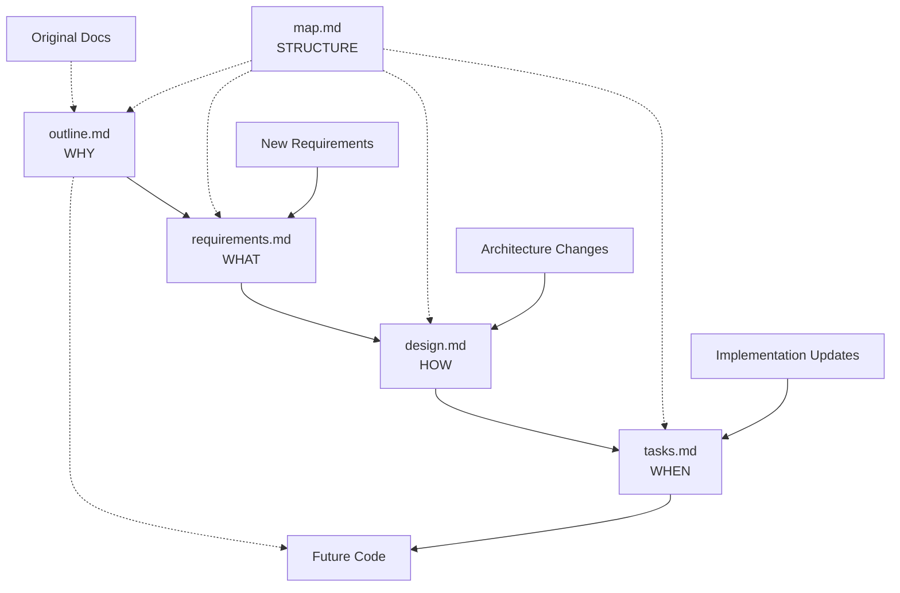

# Mycelium Network: Project Structure Map

## Current Project Organization

```
mycelium-net/
├── .kiro/specs/mycelium-net/
│   ├── requirements.md          # WHAT we need to build
│   ├── design.md               # HOW we'll build it (streamlined overview)
│   ├── tasks.md                # WHEN/steps to build it
│   ├── outline.md              # WHY we're building it this way
│   ├── map.md                  # Project structure and file organization
│   ├── architecture/           # Detailed architectural specifications
│   │   ├── core-systems/       # Spore system, consensus, storage, K3s, error handling, service lifecycle
│   │   ├── self-hosting/       # Minimal core and distributed management
│   │   ├── container-models/   # Endomycetes, Endophytes, SSI, distributed RAM
│   │   ├── networking/         # Network protocols, inter-network communication
│   │   ├── security/           # Network identity, isolation, cryptography, authentication
│   │   ├── interfaces/         # Data models and API specifications
│   │   └── integration/        # System integration patterns and cross-component coordination
│   ├── documentation/          # Project documentation and planning
│   │   ├── DEVELOPMENT_ROADMAP.md
│   │   ├── IMPLEMENTATION_READINESS_ASSESSMENT.md
│   │   ├── PROJECT_STRUCTURE_PROPOSAL.md
│   │   ├── REORGANIZATION_SUMMARY.md
│   │   └── potential-improvements.md # Identified improvements and enhancement roadmap
│   └── reference/              # Implementation patterns and examples
├── .archive/
│   ├── Digital Mycelium Network, outline 2.0.md  # Original technical spec
│   └── Digital Mycelium Network, outline.rtf     # Original concept document
└── [future implementation directories]
```

## Document Purposes and Usage

### **Specification Documents** (`.kiro/specs/digital-mycelium-network/`)

**📋 requirements.md**
- **Purpose**: Formal requirements in EARS format with user stories and acceptance criteria
- **Audience**: Product managers, QA testers, stakeholders
- **Usage**: Validation criteria for implementation, testing requirements
- **Updates**: When feature scope changes or new requirements discovered

**🏗️ design.md**
- **Purpose**: High-level technical architecture overview with references to detailed specifications
- **Audience**: Software architects, senior developers, technical reviewers
- **Usage**: Architecture overview and navigation to detailed specifications
- **Updates**: When high-level architecture changes or new major components added

**✅ tasks.md**
- **Purpose**: Actionable implementation plan with specific coding tasks
- **Audience**: Developers, project managers, implementation teams
- **Usage**: Sprint planning, progress tracking, development roadmap
- **Updates**: As tasks are completed or implementation approach changes

**🎯 outline.md**
- **Purpose**: Project vision, decision rationale, onboarding guide
- **Audience**: New team members, advisors, stakeholders, future maintainers
- **Usage**: Understanding project philosophy, decision context, big picture
- **Updates**: When major architectural decisions change or new team members join

**🗺️ map.md**
- **Purpose**: Project structure, file organization, and maintenance guidelines
- **Audience**: All team members, project maintainers
- **Usage**: Navigation, file organization, maintenance procedures
- **Updates**: When project structure changes or new files/directories added

### **Architecture Documents** (`.kiro/specs/digital-mycelium-network/architecture/`)

**🏛️ architecture/**
- **Purpose**: Detailed architectural specifications organized by system area
- **Audience**: Implementation teams, system architects, researchers
- **Usage**: Detailed technical specifications for implementation
- **Updates**: When detailed specifications change or new systems added

**Subdirectories**:
- **core-systems/**: Spore system, consensus, storage, K3s integration, error handling
- **self-hosting/**: Minimal core and distributed management details
- **container-models/**: Endomycetes, Endophytes, SSI specifications
- **security/**: Network identity, isolation, and cryptographic systems
- **interfaces/**: Data models and API specifications

### **Documentation** (`.kiro/specs/digital-mycelium-network/documentation/`)

**📚 documentation/**
- **Purpose**: Project documentation, development planning, and organizational materials
- **Audience**: Project managers, development teams, stakeholders
- **Usage**: Project planning, development coordination, organizational decision-making
- **Updates**: When project plans, assessments, or organizational decisions change

### **Reference Documents** (`.archive/` and `reference/`)

**📖 reference/**
- **Purpose**: Implementation patterns, examples, and detailed technical references
- **Usage**: Implementation guidance, code examples, performance optimization
- **Status**: Active reference materials for implementation teams

**📚 .archive/**
- **Purpose**: Historical documents and version history
- **Usage**: Historical context and original vision reference
- **Status**: Archive, preserved for historical context

## Current Project Structure (Updated)

```
mycelium-net/
├── .kiro/specs/mycelium-net/                # Specification documents
│   ├── reference/                           # Reference implementations and detailed examples
│   │   ├── virtual-computer/               # Distributed RAM system implementations
│   │   ├── isolation-models/               # Endophyte isolation strategies
│   │   ├── deployment/                     # Configuration examples
│   │   ├── adaptive-throttling-system.rs   # Throttling curve implementations
│   │   ├── kubevirt-integration.rs         # KubeVirt and QEMU integration
│   │   ├── container-deployment-models.md  # Three container deployment approaches
│   │   ├── rhizomorph-connection-layer.md  # Rhizomorph integration for distributed RAM
│   │   ├── rust-implementation-patterns.md # Rust coding patterns and examples
│   │   ├── latency-adaptation-strategies.md # High/low latency optimization
│   │   └── testing-framework.md            # Comprehensive testing approaches
├── .archive/                                 # Archived documents and version history
├── src/                                      # Rust source code workspace
│   ├── mycnet-core/                         # Minimal core components (bootstrap, networking, spore client)
│   ├── mycnet-spores/                       # Three-tier spore discovery system
│   ├── mycnet-consensus/                    # BFT consensus with commit-reveal protocol
│   ├── mycnet-storage/                      # Trust-aware distributed storage
│   ├── mycnet-networking/                   # Multi-homing and adaptive protocols
│   ├── mycnet-security/                     # Cryptography and trust management
│   └── Cargo.toml                          # Workspace configuration
├── tests/                                   # Test suites
│   ├── unit/                               # Unit tests
│   ├── integration/                        # Integration tests
│   └── chaos/                              # Chaos engineering tests
├── docs/                                    # Generated documentation
├── examples/                                # Example Endophyte services
├── tools/                                   # Development and deployment tools
├── installer/                               # Single-package installer
└── README.md                               # Project overview
```

## Document Maintenance Guidelines

### **When to Update Each Document**

**requirements.md**: 
- New features requested
- Acceptance criteria clarification needed
- User story changes
- Compliance requirements change

**design.md**:
- Architecture decisions made
- New technical challenges discovered
- Interface changes needed
- Performance requirements change

**tasks.md**:
- Implementation approach changes
- New technical dependencies discovered
- Task completion (mark as done)
- Sprint planning updates

**outline.md**:
- Major architectural philosophy changes
- New team members joining
- Significant technology decisions
- Project scope evolution

**map.md**:
- Project structure changes
- New files or directories added
- Documentation organization updates
- Maintenance procedure changes

### **Document Relationships**



### **Version Control Strategy**

- **Specifications**: Track all changes, maintain history for decision context
- **Implementation**: Standard git workflow with feature branches
- **Documentation**: Update alongside code changes, not separately
- **Structure**: Update map.md whenever project organization changes

### **Review Process**

1. **requirements.md**: Stakeholder review → Technical feasibility check
2. **design.md**: Architecture review → Implementation feasibility check  
3. **tasks.md**: Development team review → Effort estimation
4. **outline.md**: Team consensus → Vision alignment check
5. **map.md**: Team review → Organization clarity check

### **File Naming Conventions**

- **Specification files**: Descriptive names (requirements.md, design.md)
- **Source code**: Snake_case for Rust conventions
- **Documentation**: Kebab-case for consistency
- **Examples**: Prefix with example_ for clarity
- **Tools**: Descriptive names indicating purpose

### **Directory Organization Principles**

- **Separation of concerns**: Specs, source, tests, docs in separate directories
- **Logical grouping**: Related functionality grouped together
- **Scalability**: Structure supports growth without reorganization
- **Clarity**: Directory names clearly indicate contents and purpose
## Develop
ment Roadmap

### **Development Philosophy**
**Core Principle**: Build a theoretically sound and architecturally complete foundation that implements the self-hosting model with minimal core + distributed management, ensuring all implementations align with the established consensus architecture and biological metaphors.

**Self-Hosting Architecture Focus**: Every phase prioritizes the separation between minimal core components (node-local, rarely updated) and distributed management services (network-hosted, self-updating), ensuring the network can manage itself using its own distributed capabilities.

### **Phase 1: Minimal Core Foundation (1-4 nodes)**
**Goal**: Establish the minimal core layer and prove self-hosting handoff works

**Key Features**:
- Minimal core components: Bootstrap Agent, Basic Networking, Basic Spore Client, K3s Runtime
- Network identity and isolation system (essential security foundation)
- Simple Primary Spore system with basic validation and Master Seed Spore
- Core-to-network handoff mechanism with proof-of-concept Network Manager Service
- Single-package installer with stock K3s integration

**Success Criteria**:
- Minimal core successfully bootstraps and hands off to distributed Network Manager
- 1-4 node network formation with network identity validation
- Network isolation prevents accidental cross-network communication
- Self-hosting handoff mechanism works correctly
- Basic network coordination through Primary Spore system

### **Phase 2: Distributed Management Layer**
**Goal**: Complete the self-hosting architecture with full distributed management

**Key Features**:
- Complete distributed management services: Update Manager, Configuration Manager, Security Manager, Monitoring Manager
- Global Database (etcd) integration for authoritative network state
- Service Spore system for independent service discovery
- Flexible Endophyte service deployment and Kubernetes namespace isolation
- Transparent distributed storage with automatic chunking and replication

**Success Criteria**:
- Full self-hosting architecture operational with all distributed management services
- Network can update and configure itself through distributed services
- Endophyte services deploy seamlessly across nodes with transparent storage
- Service continuity during node addition/removal with automatic failover
- Network manages itself using its own distributed capabilities

### **Phase 3: Resilient Discovery and Consensus**
**Goal**: Robust spore system and Byzantine Fault Tolerant consensus

**Key Features**:
- Enhanced spore validation with tampering detection and authority hierarchy (Primary > Seed > Latent)
- Adaptive P2P Latent Spore network with CRDT-based gossip protocol
- Byzantine Fault Tolerant consensus with commit-reveal protocol and trust scoring
- Split-brain resolution and partition recovery mechanisms
- Offline node tracking and sparse network resilience

**Success Criteria**:
- Robust spore validation prevents tampering and ensures data integrity
- P2P Latent Spore network provides resilient backup discovery
- BFT consensus ensures network integrity with software-based trust establishment
- Network gracefully handles split-brain scenarios and partition recovery
- Sparse network resilience with comprehensive offline node handling

### **Phase 4: Advanced Node Hierarchy and Scaling**
**Goal**: Complete node types and adaptive scaling capabilities

**Key Features**:
- Complete node hierarchy: Dedicated/Dynamic Sclerotia, Rhizomorphs with promotion, Hyphae clients
- Multi-homing and parallel data access with automatic failover
- Hardware constraint adaptation and self-optimization
- Consumer device compatibility and scaling from 1 to thousands of nodes

**Success Criteria**:
- Full node hierarchy with promotion/demotion and adaptive role management
- Multi-homed connections provide seamless failover and parallel data access
- Network scales efficiently from single consumer devices to large enterprise deployments
- Automatic resource optimization based on hardware constraints and network conditions

### **Phase 5: Production Security and Inter-Network Communication**
**Goal**: Production-ready security and network federation

**Key Features**:
- Advanced encryption systems with per-service configurable encryption
- Administrative interfaces with RBAC and SSH-based secure management
- Inter-network communication with network identity federation and controlled bridging
- Custom K3s build optimization for performance and footprint reduction
- Comprehensive testing and validation across all system components

**Success Criteria**:
- Production-ready security with comprehensive access control and encryption
- Administrative separation with proper RBAC and secure management interfaces
- Inter-network communication enables controlled collaboration between independent networks
- Custom K3s build reduces footprint and improves performance
- Comprehensive testing validates all requirements and performance characteristics

### **Phase Progression Strategy**
- **Incremental Validation**: Each phase must prove its concepts before advancing
- **Backward Compatibility**: Later phases enhance rather than replace earlier work
- **Architectural Alignment**: All implementations validated against established self-hosting architecture
- **Practical Testing**: Real-world testing at each phase before complexity addition

### **Development Milestones**
1. **Phase 1 Complete**: Minimal core foundation with self-hosting handoff working
2. **Phase 2 Complete**: Full distributed management layer operational
3. **Phase 3 Complete**: Robust spore system and BFT consensus implemented
4. **Phase 4 Complete**: Complete node hierarchy and scaling capabilities
5. **Phase 5 Complete**: Production-ready with security and inter-network communication